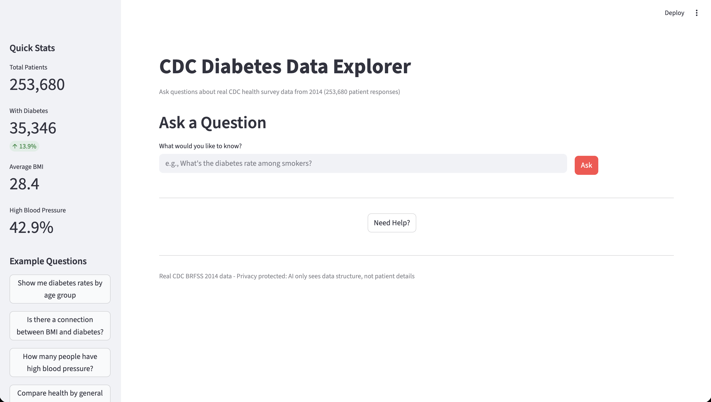
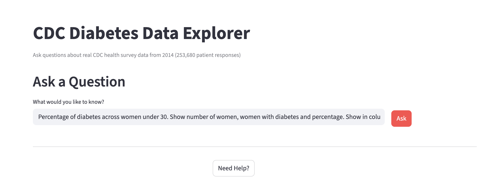
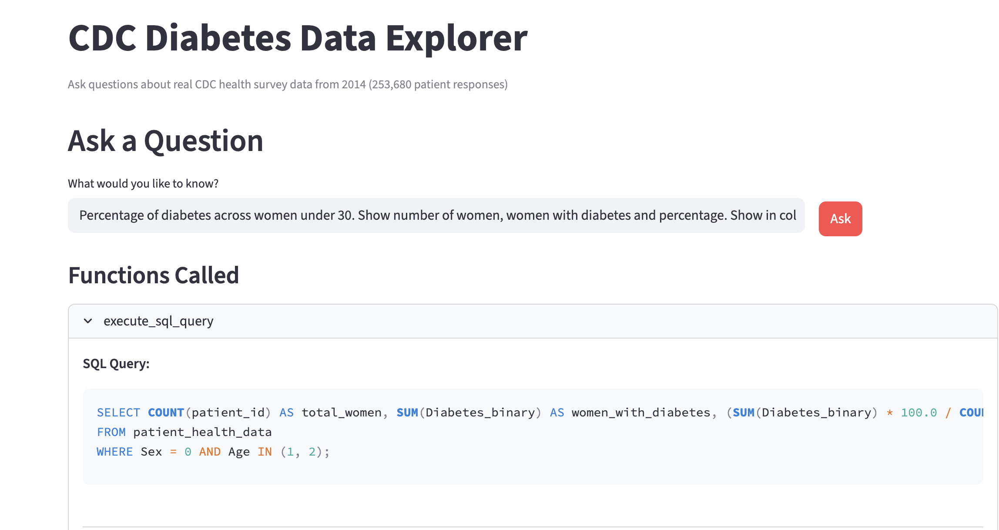
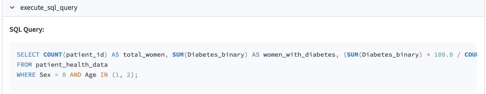
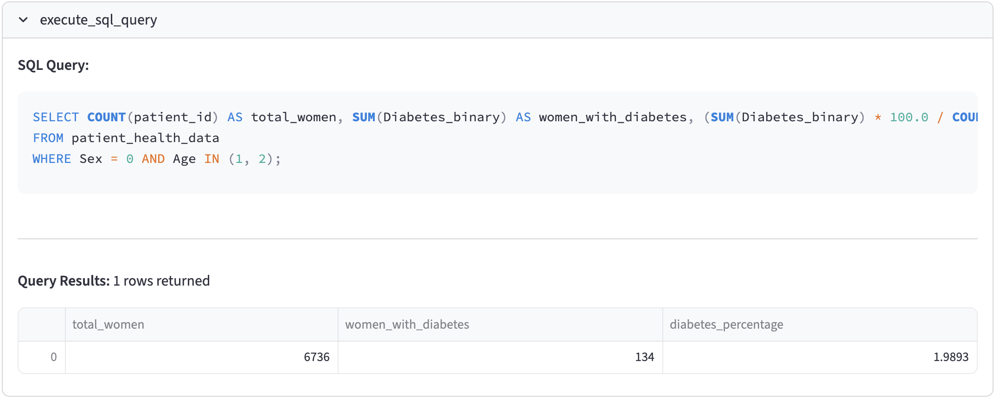
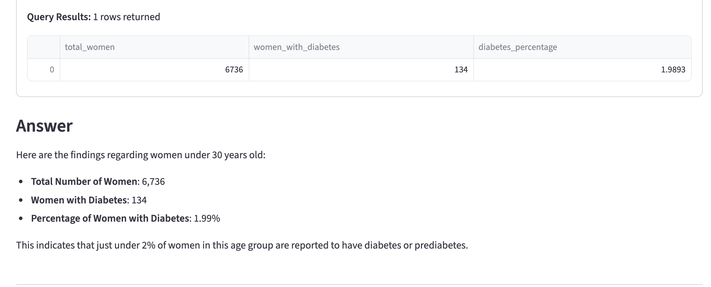
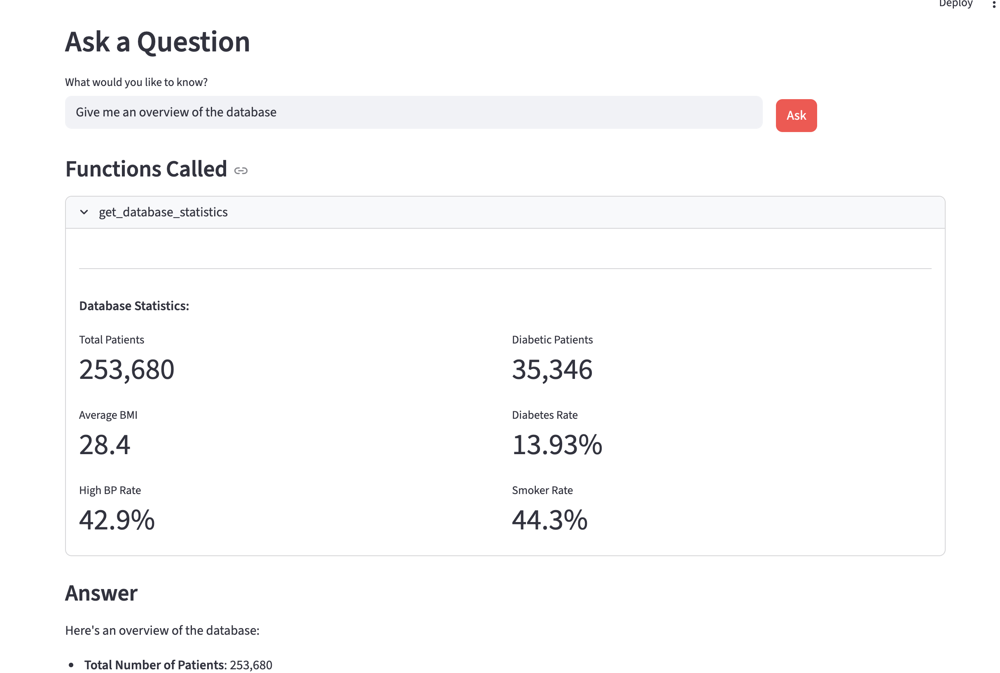
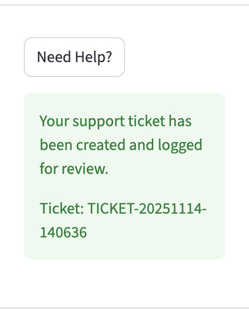
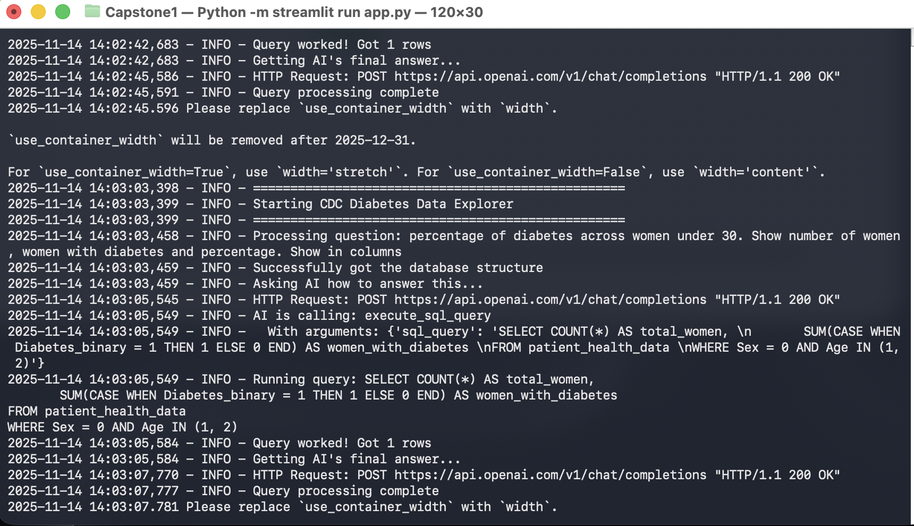

CDC Diabetes Health Data Explorer

A web application that uses AI to query real CDC health survey data through natural language questions.

Link to HuggingFace Space: https://huggingface.co/spaces/Shahiniuz/Data_Explorer

Setup

1. Install dependencies:
pip install -r requirements.txt

2. Download the CDC data:
python3 download_real_data.py

3. Create a ".env" file:
OPENAI_API_KEY=your-api-key-here

4. Run the application:
streamlit run app.py

Usage Workflow

Step 1: Open Application
Open the application in your browser. You will see the main interface with a sidebar showing database statistics.

The sidebar displays:
- Total Patients: 253,680
- With Diabetes percentage
- Average BMI
- High Blood Pressure rate
- Example questions you can ask

Step 2: Ask a Question
Type your question in plain English in the text input box. For example: "Show me diabetes rates by age group"

Click the "Ask" button to submit your question.

Step 3: View Function Calls
The interface shows which AI tools were used to answer your question. This section displays:
- Tool name (execute_sql_query, get_database_statistics, or create_support_ticket)
- SQL query generated (with syntax highlighting)
- Query results showing number of rows returned

Step 4: View SQL Query
When the AI needs to query the database, you can see the exact SQL query it generated. The query is displayed with proper SQL syntax highlighting for easy reading.

Example SQL:
SELECT COUNT(patient_id) AS total_women, SUM(Diabetes_binary) AS women_with_diabetes, (SUM(Diabetes_binary) * 100.0 / COUNT(patient_id)) AS diabetes_percentage
FROM patient_health_data
WHERE Sex = 0 AND Age IN (1, 2);

Step 5: View Results Table
The query results are displayed in an interactive data table. You can:
- Scroll through the results
- Sort by clicking column headers
- See how many rows were returned

If more than 100 rows are returned, only the first 100 are displayed.

Step 6: View AI Answer
Below the technical details, the AI provides a clear explanation of the results in plain English. The AI interprets the data and answers your original question in an easy-to-understand format.

Step 7: Database Statistics Overview
When you ask for an overview (e.g., "Give me an overview of the database"), the AI calls the get_database_statistics function. The results are displayed as metric cards showing:
- Total Patients
- Diabetic Patients
- Diabetes Rate
- Average BMI
- High Blood Pressure Rate
- Smoker Rate

Step 8: Create Support Ticket
If you need help or the AI cannot answer your question, click the "Need Help?" button. This creates a support ticket that is logged to the console with:
- Unique ticket ID
- Issue description
- Your original question
- Timestamp

Step 9: Console Logs
Open your terminal to see detailed logs of all operations:
- Query execution
- AI API calls
- Function calls with arguments
- Support ticket creation
- Error messages

Example console output:
==================================================
Starting CDC Diabetes Data Explorer
==================================================
2024-11-14 13:00:00 - INFO - Processing question: Show me diabetes rates by age group
2024-11-14 13:00:00 - INFO - Successfully got the database structure
2024-11-14 13:00:01 - INFO - Asking AI how to answer this...
2024-11-14 13:00:02 - INFO - AI is calling: execute_sql_query
2024-11-14 13:00:02 - INFO - Running query: SELECT Age, AVG(Diabetes_binary)...
2024-11-14 13:00:02 - INFO - Query worked! Got 13 rows
2024-11-14 13:00:03 - INFO - Query processing complete

Interface Features

Sidebar - Database Overview
The left sidebar displays:
- Real-time database statistics
- Quick stats cards (Total Patients, With Diabetes, Average BMI, High BP rate)
- Example questions you can click to try
- All statistics are computed from the actual 253,680 patient records

Main Interface
The main area shows:
- Question input field
- Ask button
- Functions Called section (expandable)
- Answer section with AI explanation

Functions Called Section
Each function call shows:
- Function name
- Arguments (SQL query or parameters)
- Results (data table or metrics)
- Clear separation with dividers

Data Privacy
- Only database schema (table/column names) is sent to OpenAI
- Actual patient data (253,680 records) stays on your local machine
- Query results are processed locally
- Console logs show all operations for transparency

Technical Details

Components
- OpenAI GPT-4o-mini: Converts questions to SQL and explains results
- SQLite Database: Stores 253,680 CDC patient records locally
- Streamlit: Provides the web interface
- Function Calling: AI uses 3 tools to access data

AI Tools (Function Calling)
1. execute_sql_query: Runs SELECT queries on the database
2. get_database_statistics: Gets overview statistics (totals, averages, percentages)
3. create_support_ticket: Creates help tickets logged to console

Cost per Query
- GPT-4o-mini query: ~$0.0001-0.0003 per question
- No image generation costs
- Total: approximately $0.0003 per question

Data Source
- CDC BRFSS 2014 Survey
- 253,680 patient records
- 21 health indicators
- Public domain data from UCI ML Repository
- Link: https://archive.ics.uci.edu/dataset/891

Safety Features
The application implements multiple safety measures:
- Only SELECT queries allowed
- Blocks: DELETE, DROP, TRUNCATE, ALTER, UPDATE, INSERT operations
- Query validation before execution
- All queries logged to console
- Patient data never sent to OpenAI API

Requirements

- Python 3.9 or newer
- OpenAI API key with credits
- Internet connection (for AI queries)
- ~11 MB disk space (for database)
- Modern web browser (Chrome, Firefox, Edge)

Troubleshooting

"Missing OpenAI API key":
- Check that .env file exists in the project root
- Verify the file contains: OPENAI_API_KEY=your_key_here
- Ensure there are no quotes around the key
- Restart the application after adding the key

"Database not found":
- Run python3 download_real_data.py first
- Wait for the download to complete (takes ~1 minute)
- Check that diabetes_health.db file exists in the project folder
- File size should be approximately 10 MB

"Query blocked for safety reasons":
- The app only allows SELECT queries
- Cannot modify or delete data
- This is intentional for data protection
- Try rephrasing your question to request information instead of changes

"AI response timeout":
- Check your internet connection
- Verify OpenAI API key is valid and has credits
- Try asking a simpler question
- Check OpenAI API status at status.openai.com

"No results returned":
- Your query may be too specific
- Try broadening your question
- Check the SQL query in the Functions Called section
- Look for any error messages in the console logs

"Application won't start":
- Ensure all dependencies are installed: pip install -r requirements.txt
- Check Python version: python3 --version (needs 3.9+)
- Look for error messages in the console
- Try running: streamlit run app.py --server.port 8501

Project Structure

The application consists of these files:

- app.py: Main Streamlit application with UI and AI logic
- download_real_data.py: Script to download CDC data from UCI repository
- diabetes_health.db: SQLite database with patient records (created by download script)
- requirements.txt: Python package dependencies
- Dockerfile: Docker configuration for deployment
- .env: API key configuration (you create this)
- README.md: This documentation file

Key Features

Natural Language Querying
- Ask questions in plain English
- No SQL knowledge required
- AI translates questions to SQL automatically

Data Privacy
- Patient data stays on your machine
- Only schema sent to AI
- Full transparency with console logs

Multiple Query Types
- Statistical summaries
- Filtered searches
- Aggregated data
- Comparative analysis

Interactive Results
- Sortable data tables
- Visual metric cards
- Expandable function details
- Clear AI explanations

Safety First
- Read-only database access
- Dangerous operations blocked
- All queries validated
- Complete audit trail in logs
