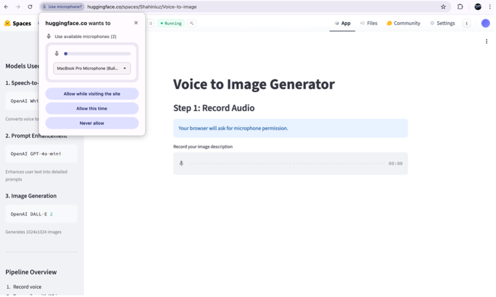
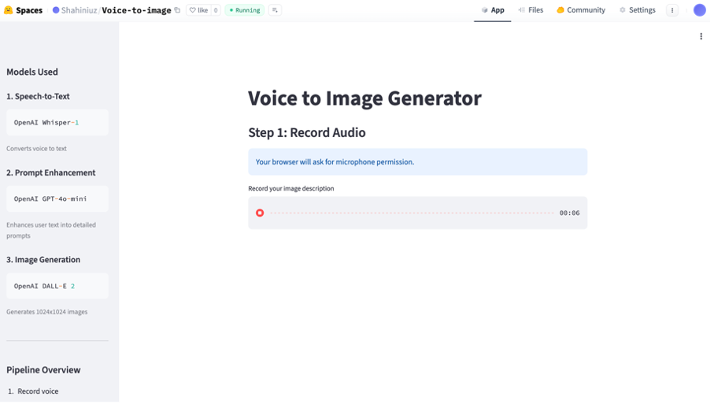
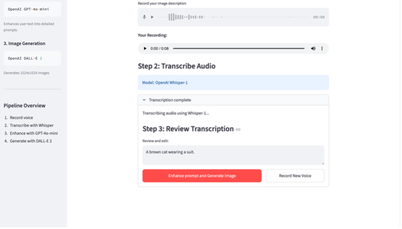
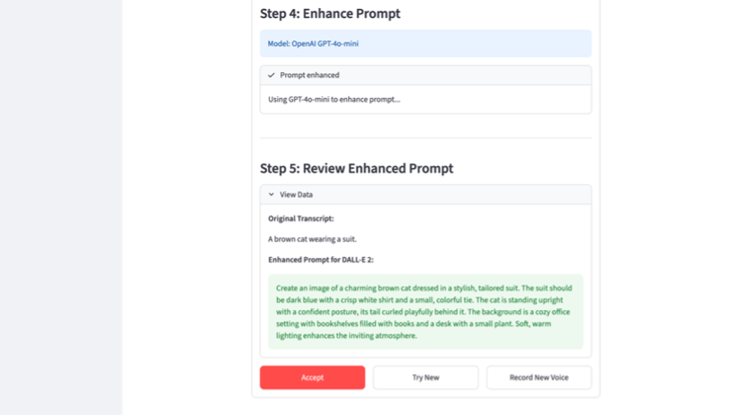
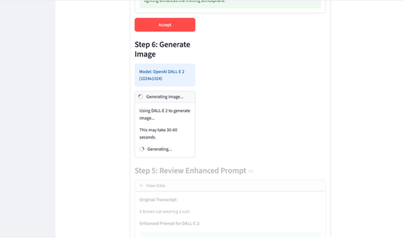
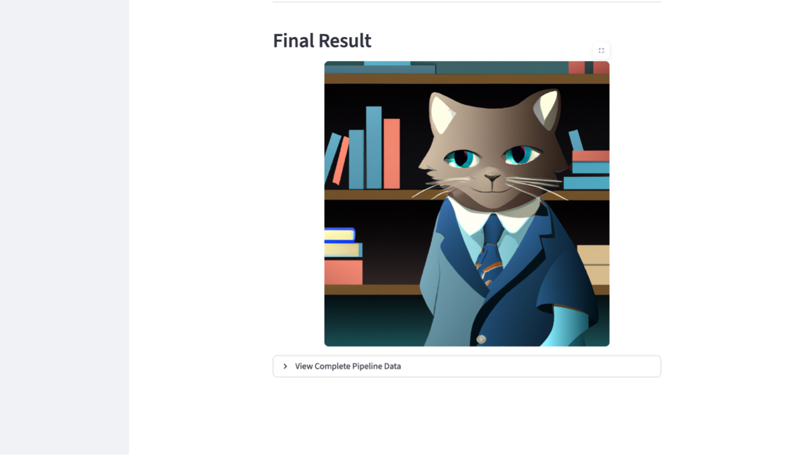

Voice to Image Generator

A web application that converts voice recordings into AI-generated images.

Link to HuggingFace Space: https://huggingface.co/spaces/Shahiniuz/Voice-to-image

Setup

1. Install dependencies:
pip install -r requirements.txt

2. Create a “.env”  file:
OPENAI_API_KEY=your-api-key-here

3. Run the application:
streamlit run app.py

Usage Workflow

Step 1: Open Application
Open the application in your browser. You will see the main interface with a sidebar showing all models used in the pipeline.

The sidebar displays:
- OpenAI Whisper-1 for speech-to-text
- OpenAI GPT-4o-mini for prompt enhancement
- OpenAI DALL-E 2 for image generation

 

Step 2: Allow Microphone Permission
Click the microphone button. Your browser will request permission to access your microphone.
 

Step 3: Record Audio
Click the record button and speak your image description clearly. For example: "a mountain landscape at sunset with purple sky"

 

Step 4: Review Transcription (Step 2-3 in UI)
The interface shows "Step 2: Transcribe Audio" with model info (OpenAI Whisper-1). After transcription completes, you see "Step 3: Review Transcription" where you can edit the text. You can click "Record New Voice" to start over with a new recording.
 

Step 5: Enhance Prompt (Step 4 in UI)
Click the "Enhance prompt and Generate Image" button. The UI shows "Step 4: Enhance Prompt" with model info (OpenAI GPT-4o-mini). The system creates an enhanced version of your description.

Step 6: Review Enhanced Prompt (Step 5 in UI)
The UI shows "Step 5: Review Enhanced Prompt" with an expandable data viewer showing:
- Original Transcript
- Enhanced Prompt for DALL-E 2

You have three options:
- Click "Accept" to generate the image with this prompt
- Click "Try New" to generate a different enhanced version
- Click "Record New Voice" to start over with a new recording
 
 

Step 7: Generate Image (Step 6 in UI)
After clicking Accept, the UI shows "Step 6: Generate Image" with model info (OpenAI DALL-E 2 1024x1024). This takes 30-60 seconds.

 
Step 8: Final Result
The generated image is displayed under "Final Result" section. Click "View Complete Pipeline Data" to see:
- Step 1: Audio Recording
- Step 2: Speech-to-Text (Whisper-1) with transcript
- Step 3: Prompt Enhancement (GPT-4o-mini) with original and enhanced prompts
- Step 4: Image Generation (DALL-E 2) with final prompt and output info

 

Interface Features

Sidebar - Models Overview
The left sidebar displays:
- All three models used in the pipeline
- Brief description of each model's purpose
- Complete pipeline overview

Step-by-Step Progress
Each step in the main interface shows:
- Step number and description
- Which model is being used
- Model-specific information (e.g., image size for DALL-E 2)

Data Transparency
All intermediate data is visible:
- Audio playback of recording
- Transcription text (editable)
- Original transcript vs enhanced prompt comparison
- Complete pipeline data viewer in final result

Technical Details

Components
- OpenAI Whisper-1: Converts speech to text
- OpenAI GPT-4o-mini: Enhances user description into detailed image prompt
- OpenAI DALL-E 2: Generates 1024x1024 images

Cost per Generation
- Whisper transcription: ~$0.006/minute
- GPT-4o-mini enhancement: ~$0.0001/request
- DALL-E 2 image: ~$0.02/image

Total: approximately $0.02 per generation

Requirements

- Modern web browser (Chrome, Firefox, Edge)
- Microphone access
- OpenAI API key with credits
- Internet connection

Troubleshooting

“Microphone not working” :
- Check browser permissions in settings
- Try Chrome or Firefox
- Ensure no other application is using the microphone

“Transcription failed” :
- Speak clearly and minimize background noise
- Record for at least 3 seconds
- Check your internet connection

“Image generation failed” :
- Verify OpenAI API key is valid
- Check API credits balance
- Ensure prompt does not violate content policy
